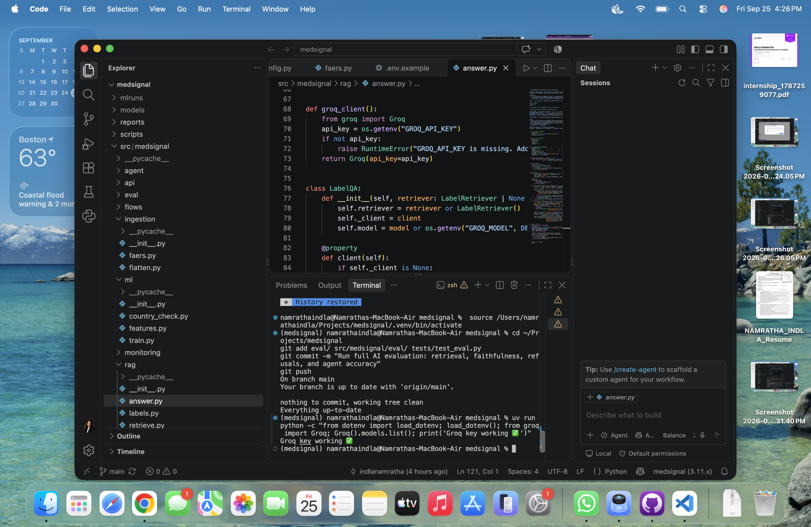
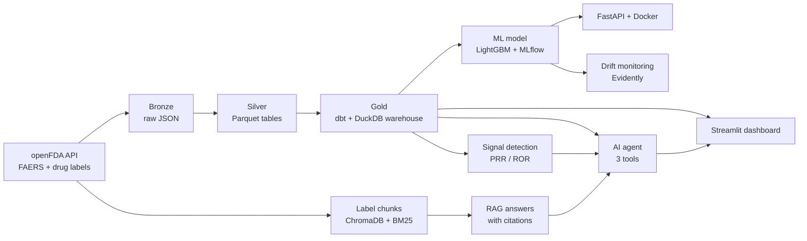
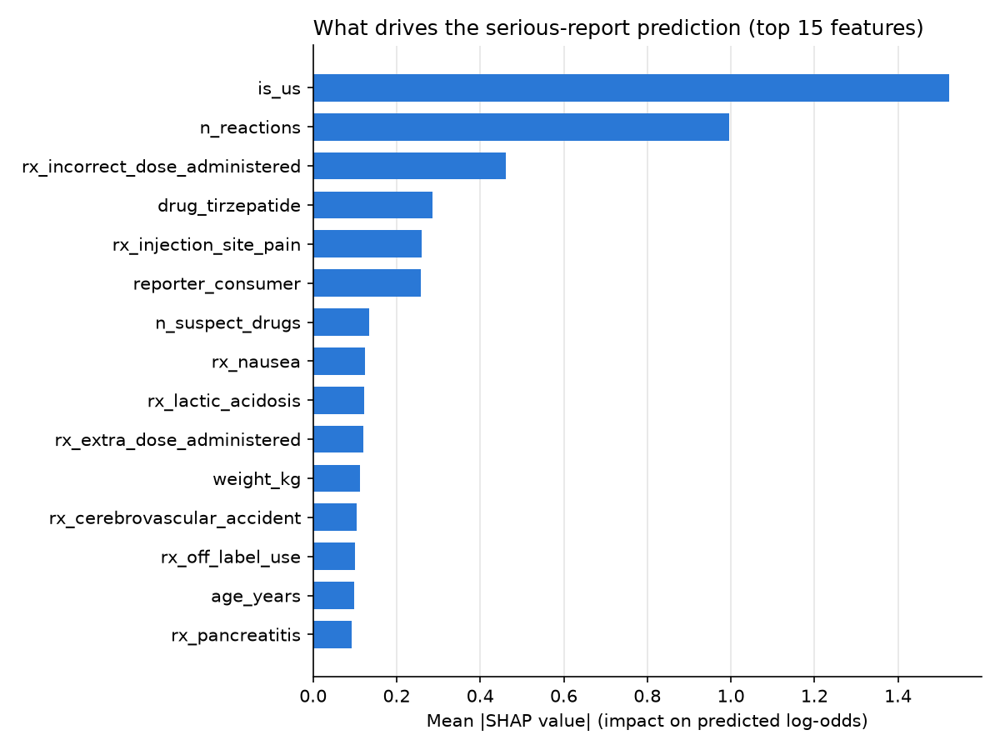
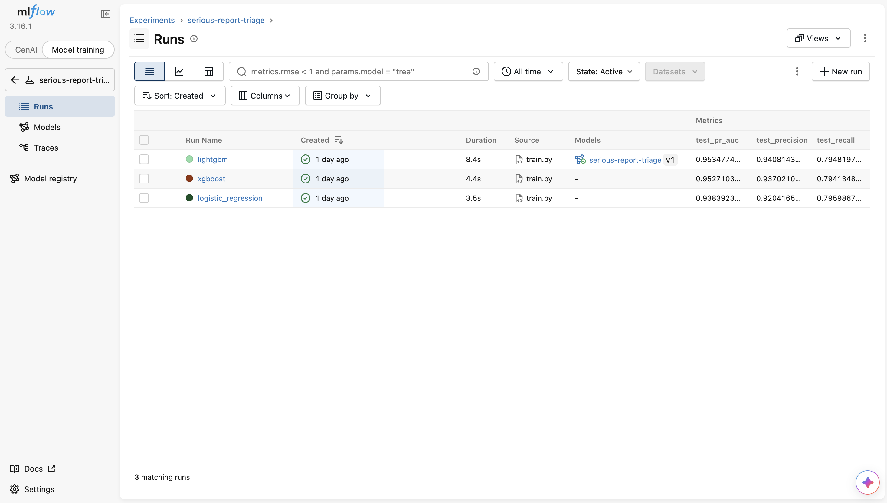
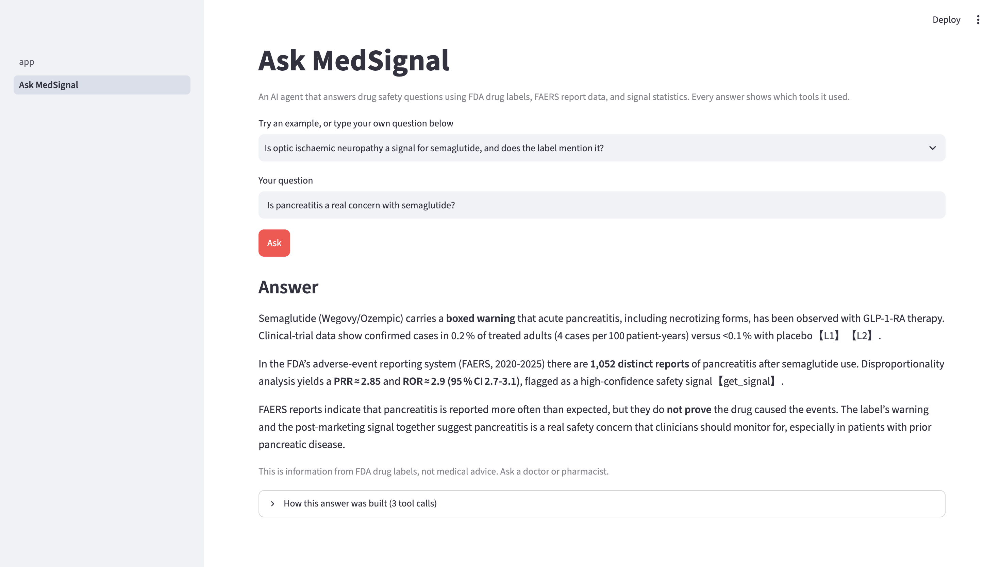

# MedSignal: Drug Safety Intelligence Platform

[](https://github.com/indlanamratha/medsignal/actions/workflows/ci.yml)


**🔗 Live demo: [medsignal.streamlit.app](https://medsignal.streamlit.app)**: explore the dashboard and ask the AI agent a question. *(The free demo uses keyword search for labels; the full hybrid + rerank pipeline runs locally.)*

An end-to-end data and AI platform built on **FDA adverse event reports (FAERS)** for 13 obesity and diabetes drug groups (Ozempic/Wegovy, Mounjaro/Zepbound, metformin, and others), 2020–2025.

It covers the full lifecycle: **data pipeline → warehouse → analytics dashboard → statistical signal detection → ML model with MLOps → RAG over FDA drug labels → a tool-using AI agent → evaluation.**



> FAERS reports show that a reaction was reported after a drug was taken. They do not prove the drug caused it. MedSignal is a portfolio project, not a medical tool.

---

## Results at a glance

| Area | Result |
|---|---|
| Data pipeline | **648,877** raw FAERS records → **543,676** unique reports → **383,296** with a study drug as suspect |
| Signal detection | Found **9 of 9** known GLP-1 adverse reactions (PRR/ROR with 95% CI, Evans criteria) |
| Serious-outcome model | LightGBM test **PR-AUC 0.953** (baseline 0.347), ROC-AUC 0.969. On US reports only: **PR-AUC 0.848** vs. 0.211 baseline |
| Drift monitoring | Evidently flagged **9 of 38** features drifted in 2025 vs. training years |
| RAG retrieval | Hit@5 **84% → 100%**, MRR **0.78 → 0.94** (BM25 baseline → hybrid + rerank + query expansion) |
| Grounded answers | Fact recall **1.00**, faithfulness **1.00** (LLM judge), **10 / 10** unanswerable questions correctly declined |
| AI agent | **8 / 8** data questions answered with the correct number (checked against reference SQL) |
| Engineering | 45 unit tests, lint and a Docker smoke test run on every push (GitHub Actions) |

---

## Architecture



Orchestrated with **Prefect**: ingest → build silver → `dbt build` (models + data tests) → drift check.

---

## What each part does

### 1. Data engineering
- Downloads FAERS reports from the openFDA API by drug and month, with retries and resumable downloads.
- **Medallion layers:** raw gzipped JSON (bronze) → flattened Parquet tables (silver) → **dbt** models in **DuckDB** (gold): `fct_report_drug`, `fct_drug_reaction`, `dim_drug`, `mart_monthly_reports`.
- dbt tests check uniqueness, not-null, accepted values, and date ranges on every build.

### 2. Analytics and dashboard
- 9 SQL analyses and a written report: [`analytics/INSIGHTS.md`](analytics/INSIGHTS.md).
- Streamlit + Plotly dashboard with filters, a drug explorer, reporter-mix analysis, and a **spike investigator**.

**Key findings**
1. **Who reports changes how "serious" a drug looks.** Tirzepatide reports are 94% from consumers and 16% serious. Metformin reports are 24% from consumers and 85% serious. Raw counts can't be compared across drugs.
2. **The biggest spikes were batches of mild reports.** The July 2025 semaglutide spike was driven by 7,916 consumer reports, only 19.6% serious, so a count-only alert rule would raise false alarms.
3. **The weight-loss drug boom is visible.** Tirzepatide reports grew from 4 (2020) to 59,369 (2025).
4. **GLP-1 drugs show a distinct pattern** vs. other diabetes drugs: impaired gastric emptying (19x), ileus (15x), and optic ischaemic neuropathy (21x).
5. **Data quality matters.** Medication-error terms and "death" appear as top "reactions" and must be handled separately.

### 3. Statistical signal detection
- PRR and ROR with 95% confidence intervals and chi-square for every drug–reaction pair.
- **Active-comparator design:** each drug is compared with the other 12 obesity/diabetes drugs, which reduces confounding by indication.
- Excludes medication-error, product-use, and outcome terms. **Validated against 9 known GLP-1 reactions, all detected.**

### 4. Machine learning: predicting serious reports
Goal: flag reports likely to be serious so reviewers can triage them first.

| Model | Test PR-AUC | Test ROC-AUC | Precision | Recall | F1 |
|---|---|---|---|---|---|
| Baseline (always predicts rate) | 0.347 | 0.500 | 0.347 | 1.000 | 0.516 |
| Logistic regression | 0.938 | 0.959 | 0.920 | 0.796 | 0.854 |
| XGBoost | 0.953 | 0.968 | 0.937 | 0.794 | 0.860 |
| **LightGBM (champion)** | **0.953** | **0.969** | **0.941** | **0.795** | **0.862** |

- **Time-based split:** train 2020–2023, validate 2024, test 2025. No random split, so no future data leaks into training.
- Threshold set on 2024 data to catch **80% of serious reports**.
- **Honest check:** 99.1% of non-US reports are serious, so country is a shortcut. On **US reports only**, PR-AUC is **0.848 vs. a 0.211 baseline**, which shows the model learns real signal. Details: [`docs/modeling.md`](docs/modeling.md).
- **SHAP** explanations for every prediction.



### 5. MLOps
- **MLflow:** every experiment tracked. The best model is registered with the alias `champion`.
- **FastAPI** `/predict` endpoint with Pydantic input validation and prediction logging, plus a test that training and serving produce identical features.
- **Docker** image (non-root user, health check, pinned dependencies).
- **GitHub Actions CI:** lint → unit tests → build the Docker image → call the live API in the container.
- **Evidently drift monitoring:** compares 2025 against the training years and recommends retraining when many features drift. A person approves any new champion.



### 6. RAG over FDA drug labels
- 33 official FDA labels split into **746 section-aware chunks** (Boxed Warning, Contraindications, and so on), each with drug, section, and label ID for citations.
- **Hybrid retrieval:** BM25 + dense embeddings (`bge-small-en-v1.5`, ChromaDB), merged with reciprocal rank fusion, then a **cross-encoder reranker**.
- Query expansion by question type and near-duplicate removal.
- Answers via Groq (`gpt-oss-120b`) as validated JSON with citations. **Guardrails:** declines without calling the LLM when retrieval finds nothing relevant, retries invalid JSON, and drops citations that don't match a retrieved passage.

### 7. AI agent: "Ask MedSignal"
A hand-written tool-calling loop (no framework, so every step is visible) with three tools:
- `search_labels`: what the FDA label says
- `query_faers`: **read-only SQL** over the warehouse. Validated with sqlglot: a single SELECT, allowed tables only, row limit, and a read-only database connection.
- `get_signal`: PRR/ROR statistics

It combines label text, report counts, and signal statistics into one cited answer.



### 8. Evaluation
A 50-question hand-written test set: 32 label questions, 10 unanswerable, and 8 data questions.

| Retrieval mode (32 questions, top 5) | Hit@5 | MRR |
|---|---|---|
| BM25 | 0.844 | 0.776 |
| Dense | 0.844 | 0.797 |
| Hybrid | 0.906 | 0.802 |
| Hybrid + rerank | 0.906 | 0.906 |
| **Hybrid + rerank + expansion + dedupe** | **1.000** | **0.944** |

- Fact recall 1.00 · Faithfulness 1.00 (LLM-as-judge, sanity-checked: a faithful answer scores 1.0, a made-up one 0.0) · Refusals 10/10 · Agent 8/8.
- Full report: [`eval/results/summary.md`](eval/results/summary.md)

---

## Tech stack

**Data:** Python 3.11, uv, openFDA API, Prefect, dbt, DuckDB, Parquet, pandas
**Analytics:** SQL, Streamlit, Plotly
**ML / MLOps:** scikit-learn, LightGBM, XGBoost, SHAP, MLflow, Evidently, FastAPI, Docker, GitHub Actions
**AI:** RAG, ChromaDB, sentence-transformers, BM25, cross-encoder reranking, Groq LLMs, tool calling, LLM-as-judge evaluation

---

## Run it yourself

```bash
git clone https://github.com/indlanamratha/medsignal.git
cd medsignal
uv sync
cp .env.example .env        # add a free openFDA key and a free Groq key

uv run python -m medsignal.flows.pipeline                # download, build warehouse, run dbt tests
uv run python -m medsignal.signals.disproportionality    # signal detection
uv run python -m medsignal.ml.train                      # train models, log to MLflow
uv run python -m medsignal.rag.labels                    # download FDA labels
uv run python -m medsignal.rag.retrieve --build          # build the search index
uv run streamlit run dashboard/Dashboard.py                    # dashboard + Ask MedSignal
```

Other commands:
```bash
uv run pytest                                            # tests
uv run python -m medsignal.eval.run_eval                 # AI evaluation
uv run python -m medsignal.monitoring.drift              # drift report
docker build -t medsignal-api . && docker run -p 8000:8000 medsignal-api   # API at localhost:8000/docs
```

---

## Limitations and next steps
- FAERS is voluntary and incomplete. Reports show association, not causation.
- The evaluation set is small and hand-written, so the perfect QA scores mean it is too easy, not that the system is perfect. Next: a larger, harder held-out set and faithfulness scoring for the agent's answers.
- Rybelsus (oral semaglutide) is missing from the label set.

---

**Author:** Namratha Indla · [GitHub](https://github.com/indlanamratha)
